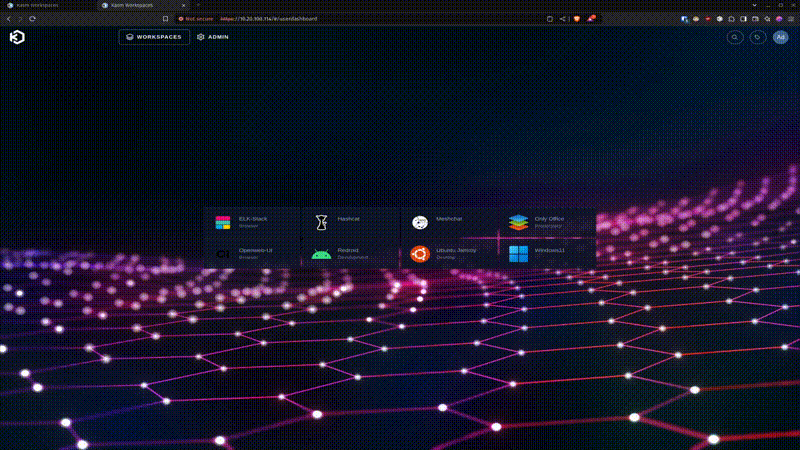

# KASM MeshChat Workspace

This project provides a custom KASM workspace for running [Reticulum MeshChat](https://github.com/liamcottle/reticulum-meshchat), a decentralized chat application built on the Reticulum Network Stack.

## Description

This KASM workspace provides a containerized environment for running MeshChat with a web-based interface. It's built on top of the KASM Ubuntu Jammy desktop image and includes all necessary dependencies for running MeshChat.

## Features

- Pre-configured MeshChat installation
- Web-based interface accessible through KASM
- Customizable Reticulum network interfaces
- Automatic startup of MeshChat service
- Desktop shortcut for easy access
- Persistent storage for configurations and connections

## Quick Start: Using Pre-built Image

### Prerequisites
- A running KASM Workspaces installation
- Admin access to your KASM Workspaces instance

You can find the documentation for installing a single server installation of Kasm here:
https://kasmweb.com/docs/latest/index.html

### Installation Steps

1. Log into your KASM Workspaces admin interface

2. Navigate to Workspaces
   - Click on "Workspaces" in the left sidebar
   - Click the "Add Workspace" button

3. Configure the New Workspace Details
   - **Workspace Type**: Container
   - **Friendly Name**: MeshChat (or your preferred name)
   - **Description**: Reticulum MeshChat Client (or your preferred description)
   - **Thumbnail URL**: https://raw.githubusercontent.com/markqvist/Reticulum/master/docs/source/graphics/rns_logo_512.png
   - **Docker Image**: williamsct1/kasm-meshchat:latest
   - **Docker Registry**: https://index.docker.io/v1/
   - **Persistent Profile Path**: `/mnt/kasm_profiles/{image_id}/{user_id}`
   - Click "Save"

4. Launch the Workspace
   - Return to the main KASM interface
   - Click on the MeshChat workspace icon
   - The workspace will launch with MeshChat automatically starting

5. Using MeshChat
   - MeshChat will automatically start when the workspace launches
   - The web interface will open automatically in Chrome
   - Your connections and settings will persist between sessions due to the enabled persistent profile



## Building Your Own Image

If you want to customize the image or build it yourself:

### Prerequisites
- Docker installed on your system
- Git for cloning the repository

### Building Steps

1. Clone this repository:
```bash
git clone https://github.com/cwilliams001/kasm-meshchat.git
cd kasm-meshchat
```

2. Build the Docker image:
```bash
docker build -t yourusername/kasm-meshchat:latest .
```

3. (Optional) Push to Docker Hub:
```bash
docker push yourusername/kasm-meshchat:latest
```

## Configuration

### Reticulum Network Interfaces

The default configuration includes several pre-configured network interfaces. You can customize these by modifying the `config` file before building the image.

The default configuration includes:
- Default Interface (AutoInterface) - Note it is commented out by default.
- RNS Testnet BetweenTheBorders
- RNS Testnet Amsterdam

To modify the network interfaces, you can either:
- Edit the `config` file in the repository before building
- Or modify the config file at `home/kasm-user/reticulum-meshchat/.reticulum/config` in your running workspace

### Troubleshooting

If MeshChat doesn't start automatically:
1. Open a terminal in the workspace
2. Run: `/usr/local/bin/start-meshchat.sh`

If you need to restart MeshChat:
1. Open a terminal
2. Run: `pkill -f "python3 meshchat.py"`
3. Then run: `/usr/local/bin/start-meshchat.sh`

## Notes
- The workspace uses persistent storage, so your MeshChat configuration and connections will be saved between sessions
- The container automatically connects to default Reticulum network nodes
- You can modify the network configuration by editing the config file at `home/kasm-user/reticulum-meshchat/.reticulum/config` or by building the container image with your interfaces.

## License

This project is licensed under the [MIT License](LICENSE) - see the LICENSE file for details.

## Acknowledgments

- [Reticulum Project](https://github.com/markqvist/Reticulum) by Mark Qvist
- [Reticulum MeshChat](https://github.com/liamcottle/reticulum-meshchat) by Liam Cottle
- [KASM Workspaces](https://www.kasmweb.com/) for the base container images
